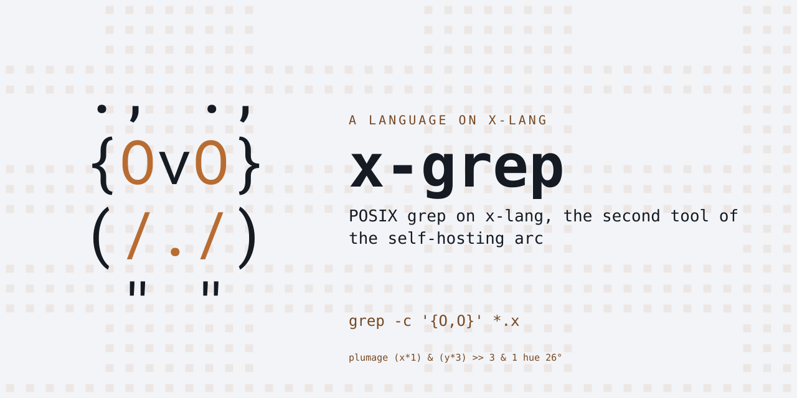
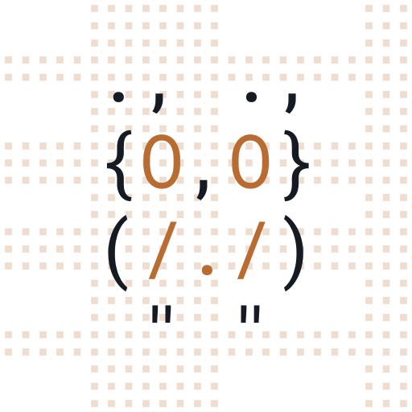

# x-grep

POSIX grep on x-lang, the second tool of the self-hosting arc (x-awk is
the first; x-lang's `docs/bootstrap-closure.md` measured grep as the
build's single most-invoked external, 4,186 calls).  BRE by default
with the escape-swap translated onto `lib/x/type/regex.x`, `-E` for the
engine's native ERE-shaped dialect, `-F` for fixed strings.

Status: pre-release.  Working: `-E -F -c -i -l -n -q -s -v -w -x`,
`-e`/`-f` pattern collection, bundled short flags, `--`, files with the
more-than-one prefix rule, `-` and default stdin, and the status
contract (0 match, 1 none, 2 trouble).  Refused loudly, recorded as
pending: back-references, `[:named:]` classes.  Divergence inherited
from the engine: leftmost-first matching where POSIX wants
leftmost-longest -- invisible to selection, visible to nothing grep
prints (grep never extracts).

Paired with x-lang v0.9.0 (`lang.xon` is the checkable row).

## Try it

    make install        # into the x on PATH

    x -l grep -- [-EFcilnqsvwx] [-e pat]... [-f patfile]... [pat] [file]...

    printf 'aa\nbb\n' | x -l grep 'a'
    x -l grep -- -in pattern file1 file2
    x -l grep -q needle haystack.txt; echo $?

The `--` lets grep's own options through x.sh's parsing; without it,
place options after the pattern.  The pure core is
`(grep-run ARGV INPUT-TEXT)` -- the suite drives it directly, with
every expectation taken from a real grep run.

## Tests

    make test           # the suite, loud on any failure
    make check          # judged against tests/contract/known-failures.txt

## Layout

    lang.xon          what this bundle IS (lang, dialect, pairing, entry)
    run.x             the entry: seam globals, and operands mean "be grep"
    grep/prims.x      the platform layer (byte doors and File, one file)
    grep/bre.x        BRE/-i/-w compiled into engine patterns; matchers
    grep/core.x       options, the line loop, the status
    grep/cli.x        argv stripping, stdin reclaim, grep-main (the exit)
    tests/            markdown specs + the platform's runner, vendored nowhere

